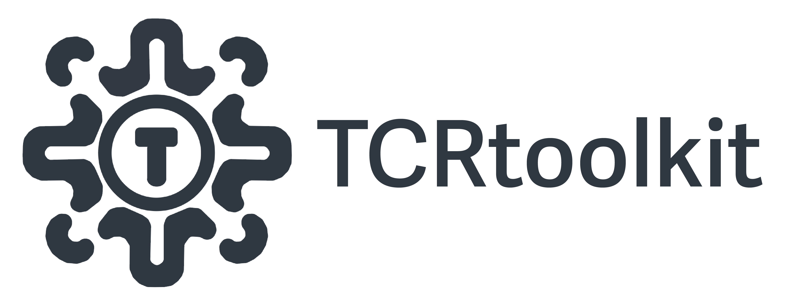

# TCRtoolkit: A T Cell Repertoire Analysis Platform



Thanks for checking out `TCRtoolkit`, the platform for T Cell Repertoire analysis! `TCRtoolkit` is wrapped in NextFlow, written in python, and uses Docker to manage dependencies.

We currently support bulk TCRseq data from Adaptive Biotechnologies, but plan to add single cell and spatial TCRseq datatypes in the near future.

##  Requirements

1. Nextflow

Nextflow can be used on any POSIX-compatible system (Linux, OS X, WSL). It requires Bash 3.2 (or later) and Java 11 (or later, up to 18) to be installed.

```{bash}
wget -qO- https://get.nextflow.io | bash
chmod +x nextflow
```

The nextflow executable is now available to run on the command line. The executable can be moved to a directory in your $PATH variable so you can run it from any directory.

2. Docker

`TCRtoolkit` runs in Docker containers available [here](https://hub.docker.com/repository/docker/domebraccia/bulktcr/general). Depending on what operating system you are running (Linux, MacOS, WSL), please refer to the [Docker documentation](https://docs.docker.com/engine/install/) for installation instructions.

3. TCRtoolkit

```{bash}
git clone https://github.com/KarchinLab/TCRtoolkit.git
cd TCRtoolkit
```


## Quick Start

Below is a minimal example of how to run the pipeline. The `minimal-example` dataset provided is a small subset of the dataset from this manuscript by [Tumeh and Ribas et al. (2014)](https://www.nature.com/articles/nature13954). Note that the results are simply for demonstration purposes and are not intended for biological interpretation.

```
## from the TCRtoolkit directory
nextflow run main.nf -entry bulk -c configs/bulk.config \
    --samplesheet test_data/minimal-example/samplesheet.csv \
    --data_dir test_data/minimal-example/ \
    --output results/minimal-example
```